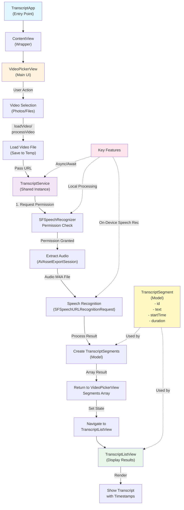

# Transcript App Architecture & Data Flow

## Architecture Overview

### Components

- **TranscriptApp**: Entry point of the application
- **ContentView**: Wrapper view that loads VideoPickerView
- **VideoPickerView**: Main UI component handling video selection and processing
- **TranscriptService**: Service layer managing speech recognition and audio extraction
- **TranscriptSegment**: Data model representing transcript portions with timing information
- **TranscriptListView**: Display layer showing transcribed content with timestamps

### Data Flow

1. User selects video from Photos library or Files app
2. Video file is loaded and temporarily stored
3. TranscriptService requests speech recognition permission
4. Audio is extracted from video in M4A format
5. On-device speech recognition processes the audio
6. Results are converted to TranscriptSegment objects
7. Navigation occurs to TranscriptListView
8. Segments are displayed with formatted timestamps

### Key Features

- **On-Device Processing**: All speech recognition happens locally without server calls
- **Async/Await Pattern**: Modern Swift concurrency for smooth UX
- **Singleton Service**: Shared instance pattern for TranscriptService
- **State Management**: Uses @State in VideoPickerView for reactive updates
